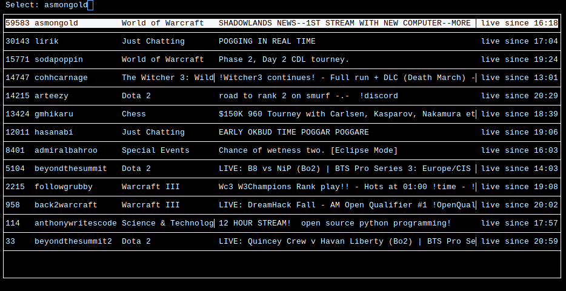

# Streamchecker.bin
## General info
### To use this, you must `#define` macros that contain your twitch user ID (v5 api) and a client id

Streamchecker fetches streams for a twitch user given its user ID and a client
id (API Key), and displays their viewers, name, game, title (optional), and time
of going live in your timezone.

You're then able to select the stream interactively, which then opens in your
`$BROWSER`. You can also select the stream non-interactively given the stream's
number in the list. (not fully supported yet).

The basic interface looks like this:

Navigation in the ncurses interface is done with vim-like movement:

`j | ↓`: Move selection to the stream below (loops to top)

`k | ↑`: Move selection to the stream above (loops to bottom)

`l | enter`: Select stream and open in `$BROWSER`

`q`: Quit the program

## Usage
Currently the only reliable command line flags are:

`-v`: Do not filter streams that are streaming vods

`-r`: Do not filter streams with type "rerun" or titles that begin with "RERUN"

`-a`: Do not filter any stream at all

`-t`: Display the title of each stream

Long options are currently broken

## Inspiration
I made this project soloely to learn c/c++, the code is very c-like and is
probably not worth your time to look at, it will soon be rewritten by me with
many more features.

